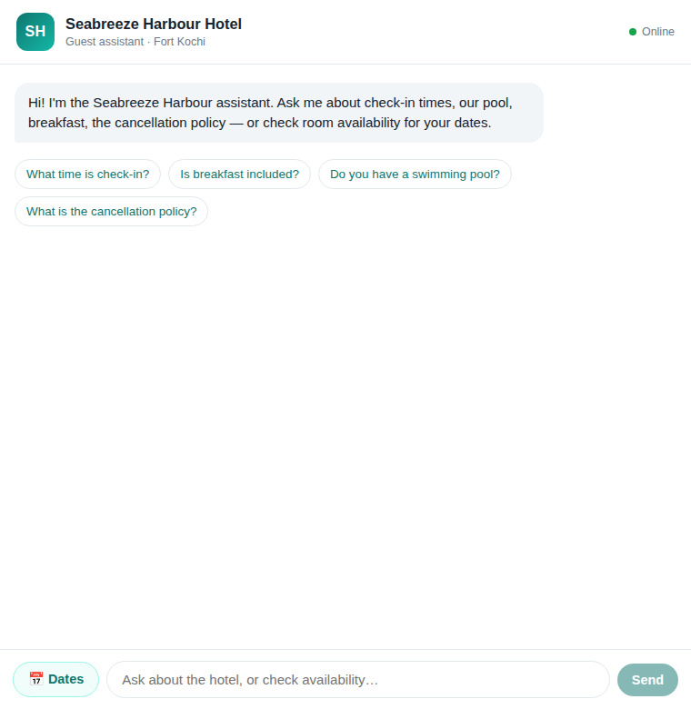

# Seabreeze Harbour — AI Guest Assistant

A small full-stack app that lets a hotel guest ask questions about the property and
check room availability from a chat window. It answers property, amenity and policy
questions from a hotel knowledge base, recognises when someone is really asking about
availability, and calls a mock booking tool to return rooms and rates.

The hotel here — *Seabreeze Harbour Hotel*, a fictional harbour-front property in Fort
Kochi — is invented for the exercise, and so is all of its data.

<p align="center"></p>

---

## What's in the box

```
simplotel assignment/
├── backend/        Node + Express API, retrieval, availability tool, optional LLM
├── frontend/       React (Vite) chat interface
├── docs/           screenshot(s)
├── ARCHITECTURE.md how the pieces fit together and the data flow
├── PRODUCT_NOTES.md product / UX / engineering / AI decisions
├── EVALUATION.md   test & evaluation scenarios with observed results
└── AI_TOOLS.md     AI tools used while building this
```

## The one design decision to read first

The assistant is built so that **the LLM never decides facts**. Retrieval and the
availability tool produce grounded facts deterministically; the model's only job is to
phrase those facts in a friendly way. A useful side effect: **the whole app runs, and
all backend tests pass, with no API key at all.** With no key it uses a deterministic
template composer instead of a model. Add an `ANTHROPIC_API_KEY` (or `OPENAI_API_KEY`)
and the same grounded answers get phrased by the LLM. This keeps the demo reproducible
and keeps hallucinations structurally hard — the model can only ever re-word facts we
already trust.

More on this in [ARCHITECTURE.md](ARCHITECTURE.md) and [PRODUCT_NOTES.md](PRODUCT_NOTES.md).

---

## Running it locally

You'll need **Node 18+** (built and tested on Node 20). Two terminals is the simplest way.

### 1. Backend (port 4000)

```bash
cd backend
npm install
cp .env.example .env        # optional — defaults are fine for a no-key demo
npm start                   # or: npm run dev  (auto-reload)
```

You should see a log line like:

```
{"level":"info","msg":"Seabreeze Harbour assistant API listening","port":"4000","llmEnabled":false,"provider":"none (deterministic mode)"}
```

### 2. Frontend (port 5173)

```bash
cd frontend
npm install
npm run dev
```

Open **http://localhost:5173**. The Vite dev server proxies `/api/*` to the backend,
so the browser only ever talks to a same-origin path — no API base URL or keys live in
the frontend.

### Turning on the LLM (optional)

Add one key to `backend/.env` and restart the backend:

```env
ANTHROPIC_API_KEY=sk-ant-...
# or
OPENAI_API_KEY=sk-...
```

`GET /api/health` will then report `"llmEnabled": true`. Everything else behaves the same.

---

## Backend API

Base URL: `http://localhost:4000`

### `POST /api/chat`

The main endpoint. Accepts a guest message plus optional conversation history and
remembered availability context.

```bash
curl -s -X POST http://localhost:4000/api/chat \
  -H 'content-type: application/json' \
  -d '{"message":"What time is check-in?"}'
```

```jsonc
{
  "reply": "Check-in starts at 2:00 PM and check-out is by 11:00 AM. ...",
  "type": "answer",             // answer | availability | needs_info | validation_error | fallback
  "intent": "general",          // general | availability
  "sources": [{ "id": "policy-checkin", "category": "policy" }],
  "availability": null,
  "missing": [],
  "context": { "slots": {} },   // echo this back on the next turn to keep context
  "meta": { "llmEnabled": false, "phrasedBy": "template", "grounded": true }
}
```

**Availability in one message:**

```bash
curl -s -X POST http://localhost:4000/api/chat \
  -H 'content-type: application/json' \
  -d '{"message":"Any rooms from 2099-06-10 to 2099-06-13 for 3 guests?"}'
```

**Availability across two turns (context carried by the caller):**

```bash
# Turn 1 — dates only. Response type is "needs_info" and asks for guest count.
curl -s -X POST http://localhost:4000/api/chat -H 'content-type: application/json' \
  -d '{"message":"do you have rooms from 2099-06-10 to 2099-06-13?"}'

# Turn 2 — reply with the guest count, replaying the context you got back.
curl -s -X POST http://localhost:4000/api/chat -H 'content-type: application/json' \
  -d '{"message":"for 2 guests","context":{"slots":{"checkIn":"2099-06-10","checkOut":"2099-06-13"}}}'
```

### `POST /api/availability`

The mock availability tool exposed directly (pure business logic, no LLM). Handy for the
date/guest picker and for testing.

```bash
curl -s -X POST http://localhost:4000/api/availability \
  -H 'content-type: application/json' \
  -d '{"checkIn":"2099-06-10","checkOut":"2099-06-13","adults":2}'
```

### `GET /api/health`

```bash
curl -s http://localhost:4000/api/health
```

Reports service status and whether an LLM provider is configured.

A ready-to-import Postman collection lives at
[`backend/postman_collection.json`](backend/postman_collection.json).

---

## Tests

```bash
cd backend
npm test
```

37 tests across 4 suites cover validation, the availability tool's determinism and
capacity rules, natural-language date/guest parsing, intent classification, knowledge
retrieval and grounding, conversation context, and the HTTP layer (including 400s, 404s,
fallbacks and the end-to-end chat flow). See [EVALUATION.md](EVALUATION.md) for how those
map to the scenario checklist.

---

## Deploying (single service)

In production the Express backend also serves the built frontend, so the whole
app is one web service behind one URL (the frontend still calls `/api` on the
same origin — no API base URL or keys in the client).

Build once, then start the backend:

```bash
cd frontend && npm ci && npm run build     # emits frontend/dist
cd ../backend && npm ci && npm start        # serves the API + the built UI
```

### One-click deploy to Render

This repo ships a [`render.yaml`](render.yaml) blueprint. On
[render.com](https://render.com): **New → Blueprint**, point it at this repo,
and Render builds the frontend and runs the backend as a single free web
service. It reads `PORT` from the environment automatically and health-checks
`/api/health`. No API key is required; add `ANTHROPIC_API_KEY` or
`OPENAI_API_KEY` in the dashboard later to enable LLM phrasing.

## Notes & limitations

- Availability is a deterministic mock — a room's status depends only on its id and the
  check-in date, so results are stable across runs. There is no real inventory or PMS.
- Conversation context is passed back and forth by the client rather than stored
  server-side; there are no user accounts or sessions.
- The knowledge base is a single JSON file. For a real property it would move behind a
  small database and an admin screen. [PRODUCT_NOTES.md](PRODUCT_NOTES.md) covers what I'd
  do before production.
